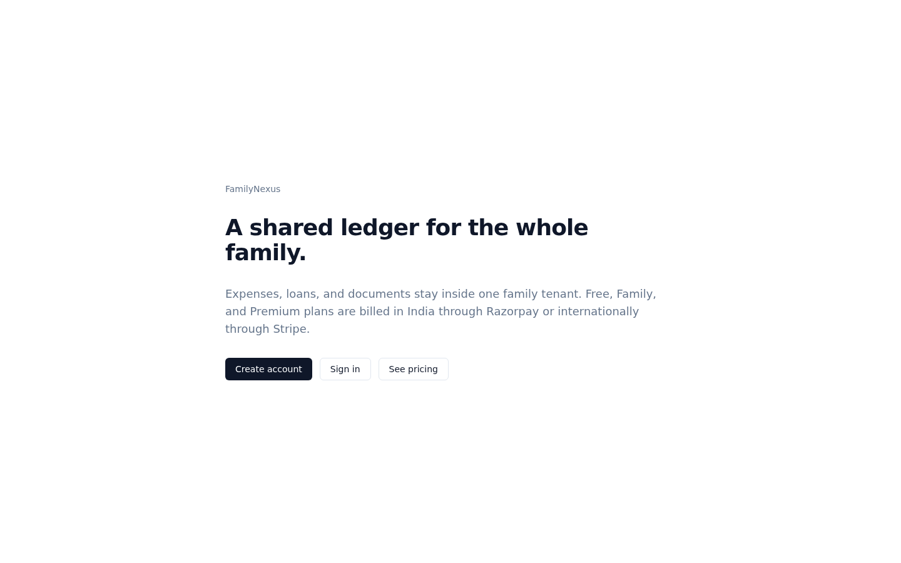
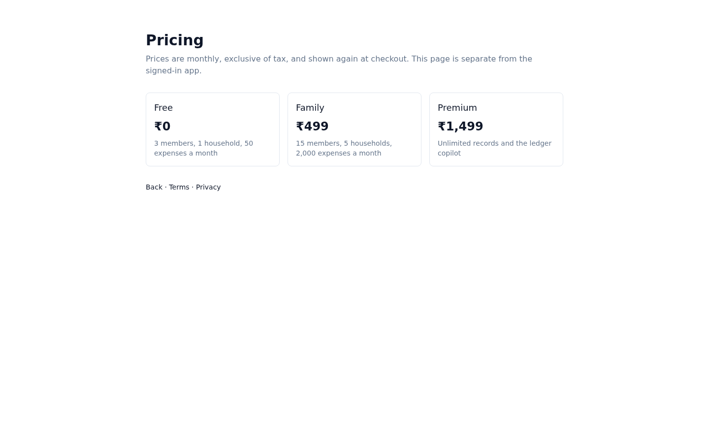
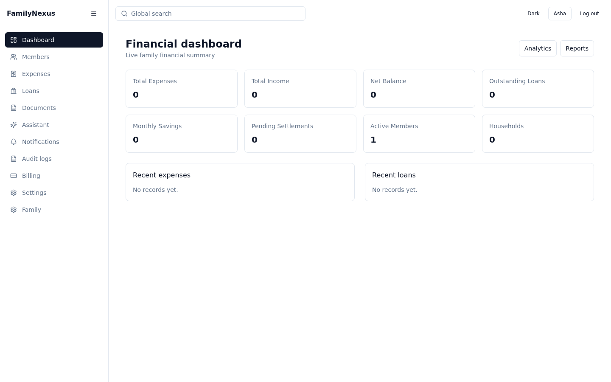
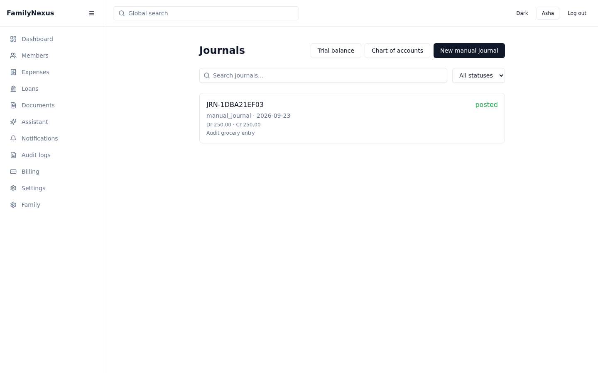
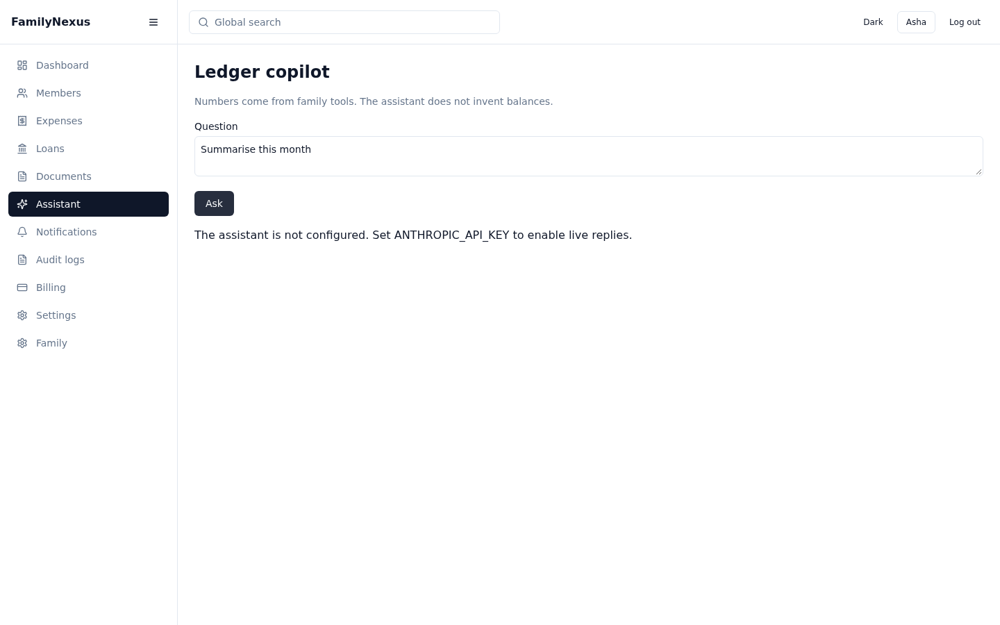
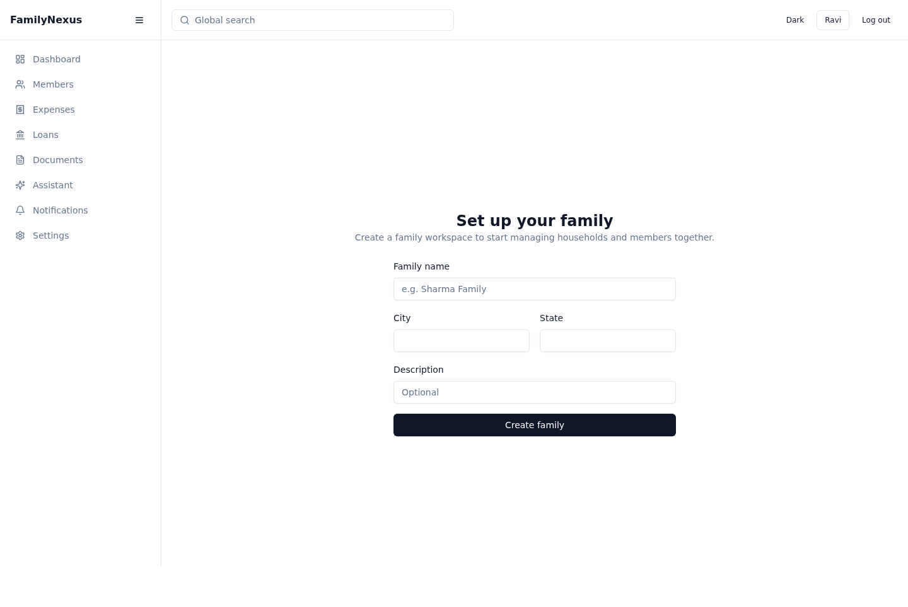

# FamilyNexus

A shared ledger for a whole family: expenses, loans, and documents stay inside one tenant, with plans, privacy export, and a ledger copilot.

## Screenshots

Public landing and pricing are separate from the signed-in app.














## Features

### Core

- Public signup at `/signup` and `POST /api/v1/auth/register/`. Development auto-verifies and returns tokens. Production sends a verification email and waits for `POST /api/v1/auth/verify-email/`. Family admins can still invite members.
- Family, household, and member records.
- Expenses, loans, borrow/lend, documents, notifications, and audit logs.
- Double-entry journals, chart of accounts, trial balance, and statements. Creating a family seeds the chart of accounts.

### SaaS / Billing

- Free, Family, and Premium plans with member, household, expense, and storage limits.
- Checkout through Stripe, Razorpay, or a manual session. Webhooks update the subscription.
- Privacy export/delete, referrals, feature flags, and an onboarding progress API.
- Public `/welcome`, `/pricing`, and `/legal/:document` pages.

### Advanced AI

- `POST /api/v1/assistant/copilot/` runs a Claude tool-use loop. Tools cover ledger summary, forecast, anomalies, category suggestion, dispute summary, savings gap, and receipt-text extraction.
- Hindi or English is selected with the `language` field (`en` or `hi`).
- A weekly Celery task sends a deterministic family summary. It does not call Claude.
- Telegram can record `expense title 120` for a linked member. WhatsApp verifies the Meta challenge and checks the signature; it does not record expenses yet.

## Tech stack

| Layer | Stack |
| --- | --- |
| Backend | Python 3.13, Django 5, Django REST Framework, PostgreSQL 17, Redis, Celery |
| Frontend | React 19, TypeScript, Vite, Tailwind CSS, shadcn/ui, React Query |
| Infra | Docker Compose, Nginx in production |

## Setup

### Backend

```bash
cd backend
python -m venv .venv && source .venv/bin/activate
pip install -r requirements/development.txt
cp .env.example .env   # set SECRET_KEY at minimum
python manage.py migrate
python manage.py runserver 0.0.0.0:8000
```

API docs: http://localhost:8000/api/v1/docs/

Create the first user with `python manage.py createsuperuser`, then sign in and create a family. Redis must be running if cache and Celery are left on the default `redis://localhost:6379/0`.

### Frontend

```bash
cd frontend
npm ci
npm run dev -- --host 0.0.0.0 --port 5173
```

App: http://localhost:5173/welcome

`VITE_API_BASE_URL` defaults to `http://localhost:8000/api/v1`. The API allows the `X-Request-ID` header the browser sends on every call.

## Environment

| Key | Required | If unset |
| --- | --- | --- |
| `SECRET_KEY` | Yes | Django will not start. |
| `DATABASE_URL` | Yes in production | Defaults to local Postgres. Tests and local sqlite can override it. |
| `REDIS_URL` | Yes for cache, throttling, and Celery | Defaults to `redis://localhost:6379/0`. Login returns 500 if Redis is down. |
| `STRIPE_SECRET_KEY`, `STRIPE_WEBHOOK_SECRET`, `STRIPE_FAMILY_PRICE_ID`, `STRIPE_PREMIUM_PRICE_ID` | Only for Stripe checkout | Checkout returns `provider_not_configured`. Manual billing still works. |
| `RAZORPAY_KEY_ID`, `RAZORPAY_KEY_SECRET`, `RAZORPAY_WEBHOOK_SECRET` | Only for Razorpay checkout | Same stub. A plan also needs `razorpay_plan_id`. |
| `EMAIL_PROVIDER=sendgrid` and `SENDGRID_API_KEY` | Only for real SendGrid mail | `EMAIL_PROVIDER=console` prints mail. |
| `EMAIL_PROVIDER=ses` and `EMAIL_BACKEND` | Only if SES is the mail provider | Same console stub. SendGrid and SES are alternatives. |
| `ANTHROPIC_API_KEY` | Only for live copilot replies | Copilot returns HTTP 503 `assistant_unconfigured` and does not call the network. |
| `FEATURE_AI_COPILOT` | No | `false` is the kill switch. Premium, or an enabled `ai_copilot` flag, is required when this is unset. |
| `VITE_POSTHOG_KEY` | No | PostHog is not loaded. `POSTHOG_API_KEY` is unused by application code. |
| `VITE_POSTHOG_HOST`, `POSTHOG_HOST` | Only with a PostHog key off the US cloud | Default `https://us.i.posthog.com`. |
| `TELEGRAM_BOT_TOKEN`, `TELEGRAM_WEBHOOK_SECRET` | Only to accept Telegram commands | Webhook returns 403 without the secret. |
| `WHATSAPP_VERIFY_TOKEN`, `WHATSAPP_APP_SECRET` | Only to verify and accept WhatsApp webhooks | Verify returns 403. Signed posts are accepted and not acted on. |

The same split is documented in [docs/LAUNCH.md](docs/LAUNCH.md).

## Tests

```bash
cd backend && pytest
cd frontend && npm run lint && npx tsc -b && npm run test && npm run build
```

`python manage.py makemigrations --check --dry-run` should report no changes.

## Current status

Live without extra keys: signup (auto-verified while `DEBUG=True`), auth, family creation, ledger CRUD, plan listing, manual checkout, public landing/pricing, and WhatsApp challenge verification.

Needs a key or service, with no further code change:

- `ANTHROPIC_API_KEY` turns the copilot from a 503 into a live Claude reply. The model can then call the family tools already registered in `ai_services/tools.py`.
- Stripe or Razorpay keys turn that provider's checkout from `provider_not_configured` into a hosted session.
- SendGrid or SES sends real mail instead of console output.
- `VITE_POSTHOG_KEY`, after analytics consent, loads PostHog.
- Redis and a Celery worker are required for throttling, welcome mail, and the weekly summary beat task.

Still partial:

- Onboarding UI creates a family only. It does not render the household, plan, and legal steps stored by `/api/v1/onboarding/`.
- Receipt extraction parses text. It does not OCR an image.
- WhatsApp does not record expenses. Telegram does, for a linked member.
- pgvector is not enabled on `postgres:17-alpine`, so embedding sync stays a no-op until that column exists. See [docs/ASSISTANT.md](docs/ASSISTANT.md).

Verified on this branch: backend `283 passed`, frontend unit tests `46 passed`, `makemigrations --check` clean, `npm run build` was already green, `tsc -b`, and `npm run lint` exited 0.
